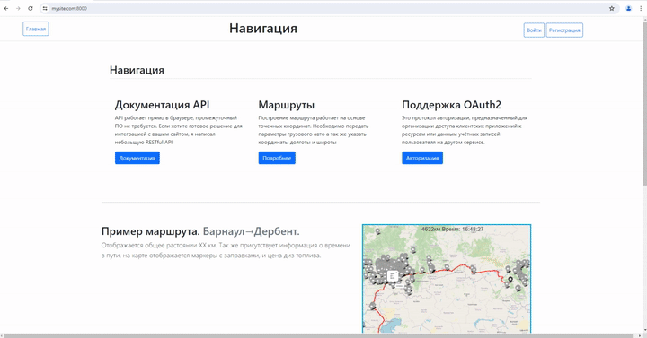
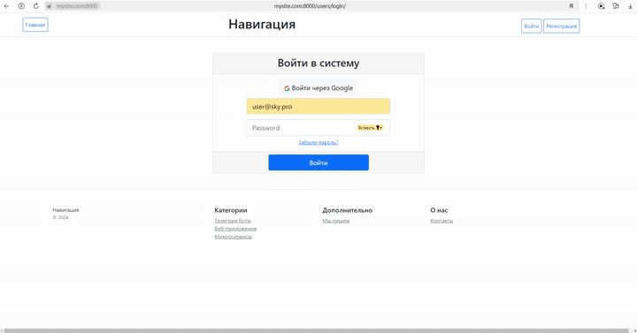

# Грузовые GPS маршруты

Предлагается веб-приложения, прокладка маршрута по РФ с отображением АЗС по пути следования грузовых авто.

## Содержание

- [Технологии](#технологии)
- [Примеры использования](#использование)
- [Быстрый старт](#docker)
- [Начало работы](#разработка)

## Технологии

- [DJANGO](https://www.djangoproject.com/)
- [DJANGO REST FRAMEWORK](https://www.django-rest-framework.org/)
- [DRF-YASG](https://drf-yasg.readthedocs.io/en/stable/readme.html)
- [DOCKER](https://docs.docker.com/engine/install/)
- [NAVITEL API](https://навител.рф/ru/apinavitelmaps/api)
- [WEATHER API](https://www.weatherapi.com/docs/#)
- [PSYCOPG2](https://www.psycopg.org/)
- [FOLIUM](https://python-visualization.github.io/folium/latest/)
- [SIMPLEJWT](https://github.com/jazzband/djangorestframework-simplejwt)
- ...

## Разработка

### Требования

Для установки и запуска проекта, необходим [Python](https://www.python.org/downloads/)
v3.12, [PostgreSQL](https://www.postgresql.org/download/windows/) 15.7
или [Docker Desktop](https://docs.docker.com/engine/install/)
<hr>

## Первое

Шаг 1. Подключить [Bootstrap](https://getbootstrap.com/docs/5.0/getting-started/download/)

## Второе

Шаг 2. Создайте файл с названием ".env" и заполните пустые поля:

<H3 style="text-align: center; color:#A7FC00;">Шаблон для файла .env </H3>
<div style="display: flex; justify-content: center;">

```dotenv
POSTGRES_DB=Route
POSTGRES_PASSWORD=
POSTGRES_USER=postgres
POSTGRES_HOST=db
POSTGRES_PORT=5432

SOCIAL_AUTH_GOOGLE_OAUTH2_KEY=
SOCIAL_AUTH_GOOGLE_OAUTH2_SECRET=

API_KEY_NAVITEL=
API_KEY_WEATHER=
```

</div>

### DOCKER

Небходимо выполнить: [Шаг 1](#первое) и [Шаг 2](#второе) далее ...

Для запуск docker, необходимо собрать образ web-приложения, с помощью команды:

```commandline
docker-compose up --build
```

После успешной сборки образа, перейдите по ссылке: [Стартовая страница](https://mysite.com:8000/)

Готово! Можно использовать web-приложение!
<hr>

### Установка зависимостей

Для установки зависимостей, выполните команду:

```pip install -r .\requirements.txt ```

Выполните команды из примера ниже:
<br>

| Описание                   | Команды                                                    |
|----------------------------|------------------------------------------------------------|
| ✔️ Приминить миграции      | ```python manage.py migrate```                             |
| ✔️ Создать пользователей   | ```python manage.py ccsu```                                |
| ✔️ Создать маршруты        | ```python manage.py route_data```                          |
| ✔️ Загрузить в БД заправки | ```python manage.py load_csv```                            |
| ✔️ Запустить HTTPS         | ```python manage.py runserver_plus --cert-file cert.crt``` |

## Использование

<H6>Презинтация проекта </H6>



<H6>Профиль </H6>



<H6>Визуализация карты </H6>


## FAQ

<a href="https://t.me/Illustrator_v">
    
</a>
